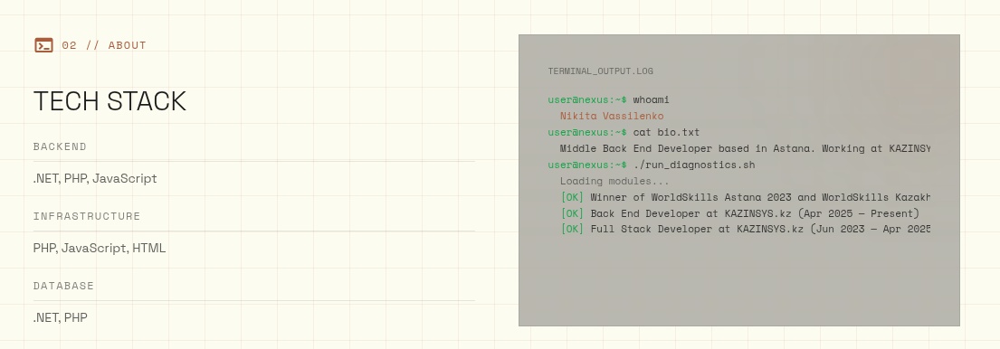
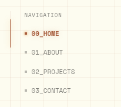
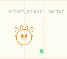

### Косяки
- переходы по темам для кнопок (белый текст и иконка скрывается белым выделением при ховер оранжевой кнопки)
- адаптив. Проблемы с переходом меню по языкам. Проблемы с планшетной версией сайта!
- На белом фоне полупрозрачный терминал не видно практически 
- Неправильная очередность навигации на главной 
- нет цветовой адаптации маскота  (бронза же на светлой версии, а не оранжевый)

---

### План решения (чеклист)

#### 1) Ховер оранжевой кнопки в теме
- [x] Найти компонент с оранжевой кнопкой (CTA) и проверить стили hover в обеих темах.
- [x] Развести стили `hover` для текста/иконки: на светлой теме не допускать белого на белом.
- [x] Проверить контраст иконки и текста в темной и светлой теме.
- [x] Закрепить решение в токенах/утилитах (если нужно) и убрать локальные хаки.

#### 2) Адаптив + меню переключения языков
- [ ] Проверить верстку Header/MobileMenu на брейкпоинтах: 768px, 1024px.
- [ ] Исправить логику и/или стили переключателя языка, чтобы он работал в мобильном и планшетном меню.
- [ ] Прогнать руками основные переходы (RU/EN, главная/проект).

#### 3) Терминал на белом фоне
- [ ] Найти блок терминала (case study / кодовый блок) и проверить фон/прозрачность на светлой теме.
- [ ] Добавить отдельный фон для светлой темы (или увеличить непрозрачность).
- [ ] Проверить читаемость текста и кода.

#### 4) Очередность навигации на главной
- [ ] Определить корректный порядок пунктов по макету/скрину.
- [ ] Обновить массив/рендер навигации на главной.
- [ ] Проверить порядок в RU/EN.

#### 5) Маскот: цветовая адаптация
- [ ] Найти источник маскота (SVG/PNG) и проверить как задается цвет.
- [ ] Добавить вариант для светлой темы (бронза), для темной — оранжевый.
- [ ] Проверить переключение темы на всех страницах.

---

### Порядок выполнения
1) Исправить ховер кнопки (быстрое влияние на UI).
2) Починить адаптив и меню языков (критично для навигации).
3) Терминал на светлой теме (читабельность контента).
4) Порядок навигации (корректность UX).
5) Маскот (визуальная полировка).
